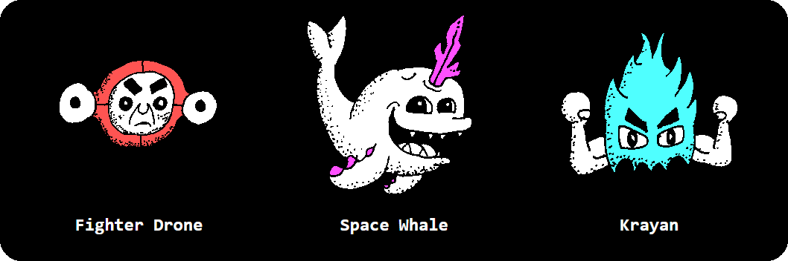

# spacetreasure.github.io

<h1>Short Instructions</h1>

Your mission: find all 4 treasures within the grid.

Click sectors next to the space sheep or previously explored sectors to move around.

When you encounter an enemy use the attack buttons to fight back.

I decided to make this game after a session with Steve an Erin Pavlina's Pirate's Plunder (1995). I wanted that game experience in a way that was convenient and not legally dubious.

Learn more about it here : https://obscuritory.com/board/pirates-plunder/ 

Hints:

- Pay attention to the text on top of the grid.

- There is a weapon for each kind of enemy that will take them down in 1 hit.

- The most powerful enemy (krayans) are usually next to treasure.

- The second most powerful enemy (space whales) may hang out around supply crates.

- The weakest enemy (fighter drones) may drop mines.

- When the location of something you don't want to deal with is revealed, you might consider carving around it so you can remember where it is.

<h1>Long Instructions</h1>

Objective:

You guide a space sheep who, in exchange for a cool pair of shades, agreed to track down the 4 treasures in this region of space before they fall into the wrong hands.

Beta's Head: From an android that became a high ranking officer in Space Fleet and was destroyed being a hero. His omnitronic brain is full of Space Fleet intel that could disrupt the balance of power within the galaxy.

John Starrunner's Laser-Sword: John Starrunner was a powerful space-knight with magic powers until a clever space captain blew him, along with his laser-sword, through an airlock instead of fighting him directly. Said to be able to cut through just about anything and somehow deflect lasers. Were someone to reverse engineer this device: it could be disastrous.

Quantum Wrench: Left behind by a careless time traveller. This device is said to be able to repair anything. This could potentially make a spaceship indestructible – or just as soon cause a time paradox.

Unicorn's Eye: The evil Unicorn was once a colossal robot that got blown up by giant robots who fought with other giant robots for no known reason. Some of these robots seek to rebuild Unicorn. One of the eyes were destroyed so it's in everyone's best interest that they don't get hold of this one.

Enemies: 

Fighter Drones: Pride themselves on being “very useful robots” when they are an annoyance in actuality. They have been known to leave mines laying about. These are the weakest enemies you'll encounter.

Space Whales: Were once the natural predator of the krayans until they discovered that star ships full of tasty humanoids made for easier prey. They're highly intelligent and open to trying new things – like space mutton. Subsequently, they tend to camp out around supply crates.

Krayans: Known for their fabulous hair and picking fights with everything except space whales. They tend to guard treasure in hopes of encountering someone or something to fight – like you. This is the most powerful enemy you'll encounter.

Weapons:

Laser: A cybernetic implant that runs off the space sheep's energy. Weak but effectively unlimited.

Electro Cannon Ball: An electrically charged ball of lead. A simple weapon that reeks havoc on electrical systems.

Kamikaze Android: One of many cheaply-made robots fitted with explosives. Many alien species can't tell the difference between these and actual humans.

Space Whale Shards: From the processed horn/crystal of a space whale. These crystals are razor sharp and emit a radiation that harm some lifeforms more than others.

Goodies:

Supply Crate: Heals the space sheep and provides 1 of each kind of ammo.

Ammo Box: Provides one of each kind of ammo.

Healing Nebula: Heals the space sheep with lime-scented healing gasses.

Bubble Gate: Surrounds the space sheep in a protective bubble. This bubble will protect the space sheep from all nebulae (including the healing ones) and one hit from anything that would otherwise harm the space sheep – except a nuke.

Treasure Finder: Locates the approximate (or sometimes accurate) location of the nearest treasure.

Short Range Scanner: Reveals an area of the grid around the space sheep.

Long Range Scanner: Reveals an area of the grid of your choosing.

Space Radar: May show you what nearby sectors contain something OR even clear away empty unexplored sectors.

Krayan Detector: Shows you the location of the nearest krayan OR possibly every krayan.

Enemy Detector: Shows the locations of the nearest enemies.

Traps:

Mines: They do damage plain and simple.

Enemy Teleporter: Pulls in the nearest enemy for a fight.

Acidic Nebula: Hides explored sectors by eating away at the space sheep's space map.

Something In Between:

Nuke: Destroys 1 (or 9) unexplored sector(s) of your choosing with a nuclear explosion! Should the space sheep or a treasure get caught in the blast: it's game over.

Hungry Nebula: A living nebula that is always hungry. Will continue to gnaw at the space sheep until you find an enemy or another hungry nebula for it to eat.